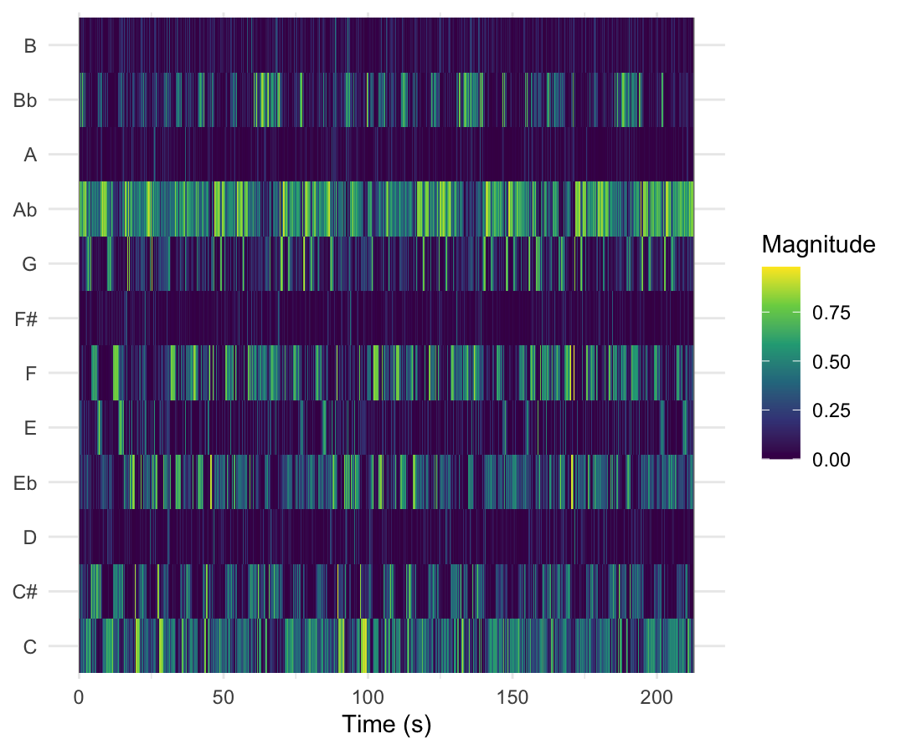
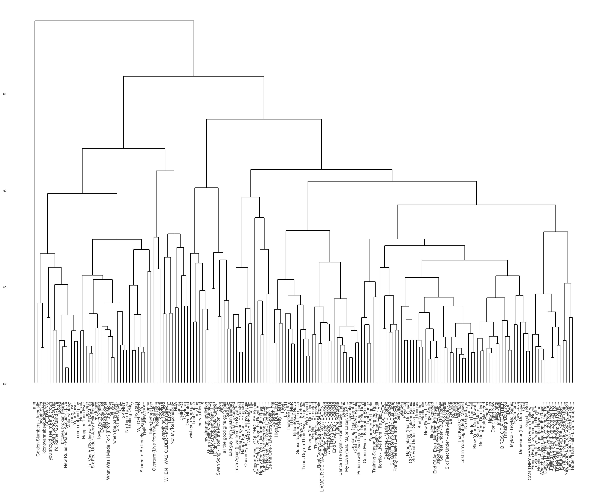

# Corpus description

Work in progress

# Chromagram

## Column {width="40%"}

For the homework assignment of week 9 I created a chromagram of the track These Walls by Dua Lipa. The chromagram shows what notes one can hear during the song and when they occur. They are not necessarily shown in the right octave.

Visible in the chromagram is that the tone Ab occurs the most. This could indicate that Ab is the tonic of the song, which in this case is correct. Besides Ab, the tones F, Eb and C are used very frequently. This could mean that chords such as Ab major (Ab, C, Eb), c minor (C, Eb, G) and f minor (F, Ab, C) are used frequently in the song.

## ###Row

## \### Row {height="20%"}

# Dendrogram

## Column

This is a dendrogram that contains the full discography of Billie Eilish and Dua Lipa.

## ###Row

