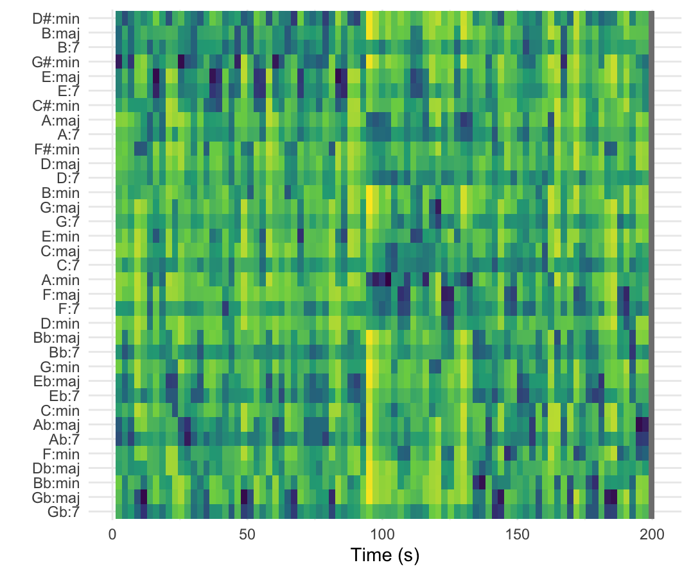
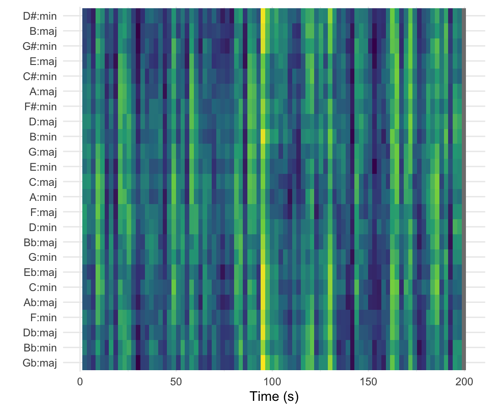

# Welcome
Computational Portfolio Mare van Oevelen

## Column {width=40%}
In the graphs below you can see the analysis of keys and chords of the song we used in class last week. The first graph is the chordogram and the second graph is the keygram.

### Row {height=20%}
---

## 
